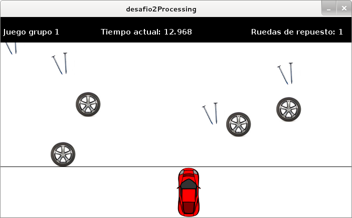
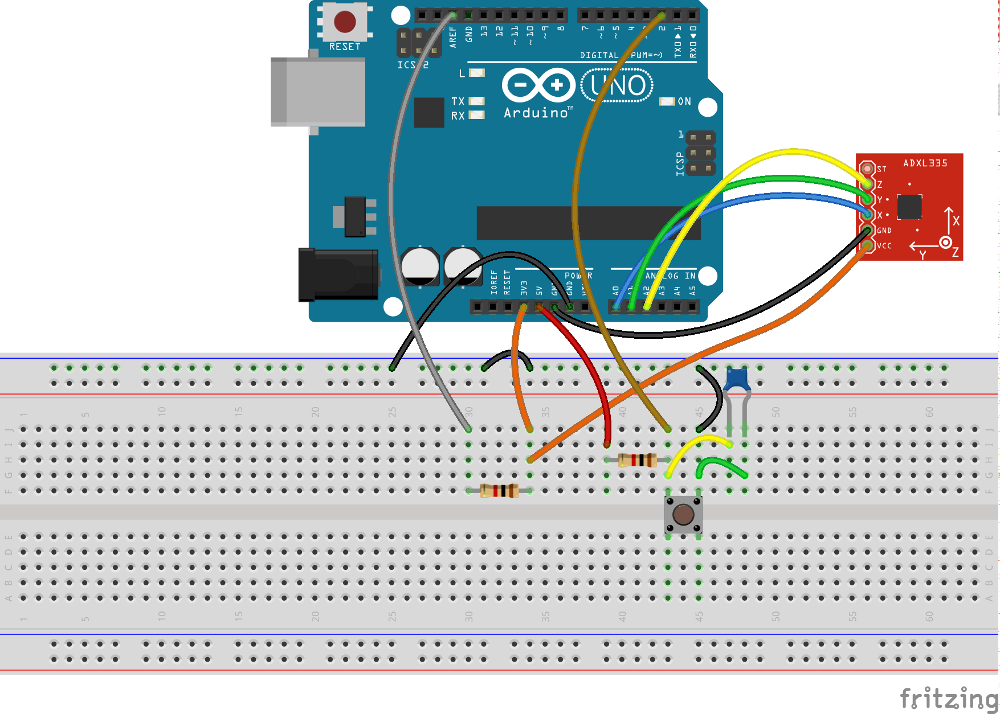

Desafío dos.

Requerimiento: Crear un juego que sea controlado mediante un Arduino con un acelerómetro y un botón.

Se usó Processing para generar el juego. Las librerías utilizadas fueron:
* ddf.minmi (audio)
* serial

La idea del juego es recoger ruedas y evitar clavos. Cada rueda suma un punto, y cada par de clavos resta dos puntos. 

Las conexiones necesarias fueron las siguientes las:

